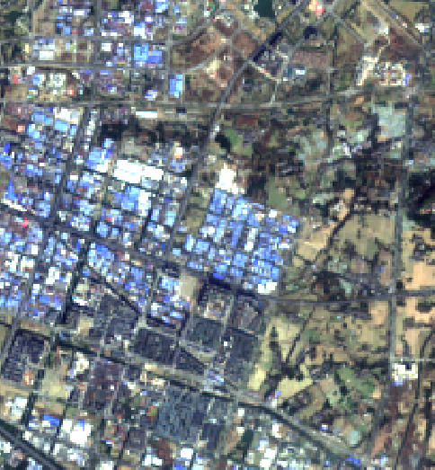
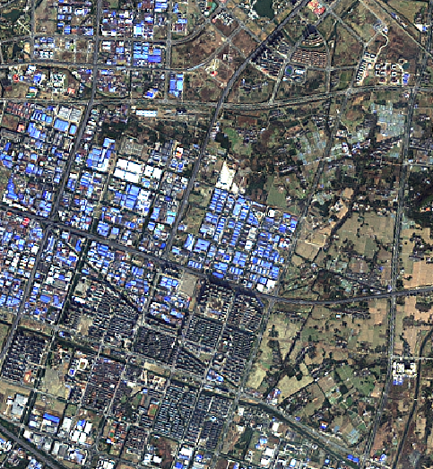
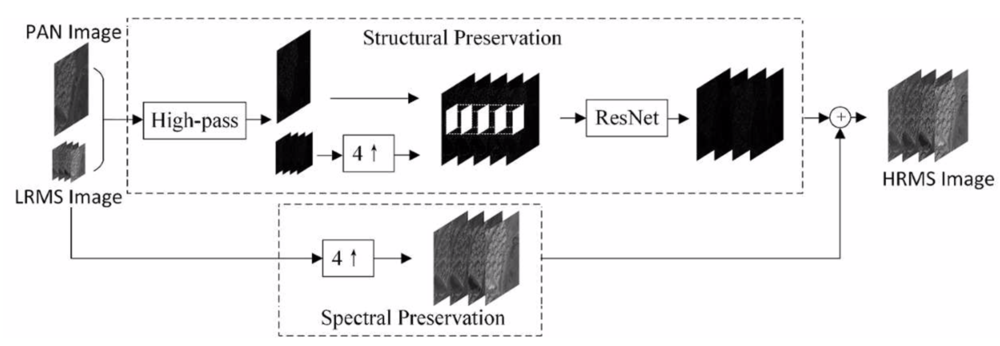

# PanNet-Landsat
Implementation of PanNet by Chainer. Landsat 8 images are used in this repository.  

|Original RGB (resolution: 30m)|Pansharpened by PanNet (resolution: 15m)|
|---|---|
|||  

Original RGB image is created by gdal_merge. Both images are screenshots of QGIS on my laptop.

### Architecture of PanNet

### Demo on Google Colab
Please see [examples/demo_on_colab.ipynb](https://github.com/oyam/PanNet-landsat/blob/master/examples/demo_on_colab.ipynb)

### References
* PanNet: A deep network architecture for pan-sharpening   http://openaccess.thecvf.com/content_iccv_2017/html/Yang_PanNet_A_Deep_ICCV_2017_paper.html
